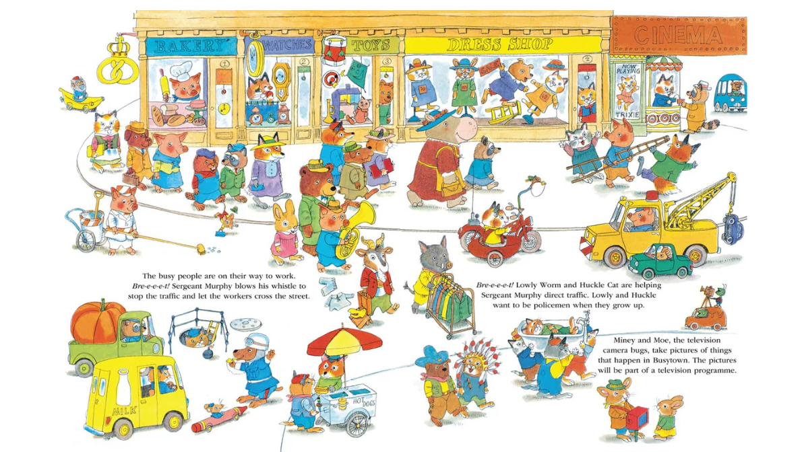

# busytown-pi

_A town full of busy little guys who do things_

**busytown** is a multi-agent factory built around a SQLite event queue. It can be used standalone, or as a [Pi](https://github.com/nichochar/pi-coding-agent) extension.

Agents listen for events, react to them, and push new events, forming asynchronous assembly lines. Agents don't need to know about other agents, just about events.

<p></p>

## How it works

Everything is stored in a single SQLite database (`.busytown/events.db`).
Events are simple JSON objects:

```json
{
  "id": 1,
  "type": "plan.request",
  "timestamp": 1709568000,
  "worker_id": "user",
  "payload": { "prd_path": "docs/feature.md" }
}
```

The worker system polls the queue and dispatches events to matching agents.
Agents run in parallel, processesing the events they care about, one at a time,
in order. Each agent:

- **Listens** for specific event types (exact match or glob like `task.*`)
- **Reacts** by reading files, writing code, producing artifacts
- **Pushes** new events to notify other agents of what it did
- **Claims** events when needed, so only one agent acts on a given event

## Architecture

```
┌──────────┐    push     ┌─────────────────┐    dispatch    ┌───────────┐
│  Pi /    │───────────▸ │  SQLite Event   │ ─────────────▸ │  Agent    │
│  CLI     │             │  Queue          │ ◂───────────── └───────────┘
└──────────┘             │                 │    push new
                         │  events table   │    events
                         │  worker_cursors │
                         │  claims         │
                         └─────────────────┘
                                 ▲ │
                                 │ ▼
                            ┌───────────┐
                            │  Agent    │
                            └───────────┘
```

## Getting started

### Install as a pi package

```bash
# Project-local (shared with your team via .pi/settings.json)
pi install -l npm:busytown-pi

# Global (available in all projects)
pi install npm:busytown-pi

# Or try it for a single session
pi -e npm:busytown-pi
```

### Install via npm (standalone CLI)

```bash
npm install -g busytown-pi
```

### Directory structure

```
your-project/
├── .pi/
│   ├── settings.json    # Package config (if using pi install -l)
│   └── agents/          # Agent definitions (markdown files)
└── .busytown/
    └── events.db        # SQLite event queue (auto-created)
```

## Building an agent factory

The Busytown package comes with a handful of agent factories in the `examples` directory.

To get started with the plan → code → review ralph loop example, copy the agents from `examples/ralph/` to `.pi/agents/`:

```bash
cp -r node_modules/busytown-pi/examples/ralph .pi/agents
```

Then open Pi. You'll see your agents listed above the input field.

```
pi
```

Ask the agent to fire off an event:

```
Push a "plan.request" message with payload '{"prd_path": "docs/add-auth.md"}'
```

This triggers the ralph loop: plan → code → review → plan... repeat until approved.

### Writing your own agents

An agent is just a markdown file in `.pi/agents/`. The filename becomes the agent's
ID (e.g., `summarizer.md` → agent ID `summarizer`).

```markdown
---
listen:
  - "task.created"
tools:
  - read
  - write
---

When you receive a `task.created` event, read the file at
`payload.file_path` and summarize it to `summaries/<name>.md`.

Then push a `task.summarized` event.
```

### Frontmatter fields

| Field         | Type                     | Default | Description                                          |
| ------------- | ------------------------ | ------- | ---------------------------------------------------- |
| `type`        | `"pi"` \| `"shell"`      | `"pi"`  | Agent type                                           |
| `name`        | `string`                 | ""      | Name of the agent                                    |
| `description` | `string`                 | `""`    | What this agent does                                 |
| `listen`      | `string[]`               | `[]`    | Event patterns to listen for                         |
| `emits`       | `string[]`               | `[]`    | Event types this agent can emit (documentation only) |
| `ignore_self` | `boolean`                | `true`  | Ignore events this agent emitted                     |
| `tools`       | `string[]`               | `[]`    | Pi tools available to the agent                      |
| `model`       | `string`                 | —       | Model override (e.g., `"opus"`, `"sonnet:high"`)     |
| `hooks`       | `Record<string, string>` | —       | Shell scripts to run during pi lifecycle events      |

### Agent types

**Pi agents** (`type: "pi"`, the default) run as `pi --mode json` subprocesses.
The event JSON is piped to stdin, and the agent's markdown body becomes its
system prompt. Pi agents can use tools and the CLI to push events and claim work.

**Shell agents** (`type: "shell"`) run the body as a shell script via `sh -c`.
The body is rendered as a Mustache-style template with access to the triggering
event:

- `{{event.type}}` — shell-escaped value (safe by default)
- `{{{event.payload.path}}}` — raw value (no escaping)
- Dot paths walk nested objects. Missing keys resolve to empty string.

### Event patterns

The `listen` field supports:

- `"task.created"` — exact match
- `"task.*"` — prefix match (matches `task.created`, `task.updated`, etc.)
- `"*"` — match all events

### Hooks

Pi agents can run shell commands at specific points in the Pi lifecycle. Add a
`hooks` map to the agent's frontmatter, keyed by the lifecycle event name:

```markdown
---
listen:
  - "task.*"
hooks:
  session_start: echo "session started at $(date)"
  before_agent_start: cat context.json
  tool_call: |
    if [ "{{{toolName}}}" = "bash" ]; then
      echo "blocked" >&2; exit 1
    fi
---
```

Hook values are shell commands executed via `sh -c`. They support Mustache-style
template variables (`{{{var}}}` for raw, `{{var}}` for shell-escaped) with
access to context like `cwd`, `model`, `timestamp`, and hook-specific extras
(e.g., `turnIndex`, `toolName`, `prompt`).

| Hook                     | Behavior        | Extras                                        |
| ------------------------ | --------------- | --------------------------------------------- |
| `session_start`          | fire-and-forget |                                               |
| `session_shutdown`       | fire-and-forget |                                               |
| `session_before_switch`  | cancellation    | `reason`                                      |
| `session_switch`         | fire-and-forget | `reason`, `previousSessionFile`               |
| `session_before_fork`    | cancellation    | `entryId`                                     |
| `session_fork`           | fire-and-forget | `previousSessionFile`                         |
| `session_before_compact` | cancellation    |                                               |
| `session_compact`        | fire-and-forget |                                               |
| `session_before_tree`    | cancellation    |                                               |
| `session_tree`           | fire-and-forget |                                               |
| `before_agent_start`     | inject message  | `prompt`                                      |
| `agent_start`            | fire-and-forget |                                               |
| `agent_end`              | fire-and-forget |                                               |
| `turn_start`             | fire-and-forget | `turnIndex`                                   |
| `turn_end`               | fire-and-forget | `turnIndex`                                   |
| `tool_call`              | blocking        | `toolName`, `toolCallId`                      |
| `tool_result`            | fire-and-forget | `toolName`, `toolCallId`, `isError`           |
| `input`                  | fire-and-forget | `text`, `source`, `prompt`                    |
| `model_select`           | fire-and-forget | `source`, `previousModel`, `previousProvider` |

- **fire-and-forget** — The command runs; its exit code is ignored.
- **cancellation** — A non-zero exit code cancels the operation.
- **blocking** — A non-zero exit code blocks the tool call. The stderr output
  is returned as the block reason.
- **inject message** — If the command exits 0, its stdout is injected as a
  custom message into the conversation.

All hooks share a base set of template variables: `cwd`, `sessionFile`, `model`,
`provider`, and `timestamp`.

## Tools & commands

Busytown registers several additional tools for agents:

| Tool              | Description                         |
| ----------------- | ----------------------------------- |
| `busytown-push`   | Push an event to the queue          |
| `busytown-events` | List recent events (with filtering) |
| `busytown-claim`  | Claim an event for exclusive access |

You can manually call these tools, plus a few additional commands, from the Pi console.

| Command             | Detail                                                          |
| ------------------- | --------------------------------------------------------------- |
| `/busytown-push`    | `/busytown-push plan.request '{"prd_path": "docs/feature.md"}'` |
| `/busytown-events`  | `/busytown-events --tail 10 --type plan.*`                      |
| `/busytown-claim`   | `/busytown-claim 42 my-worker`                                  |
| `/busytown-console` | Display the event console                                       |
| `/busytown-start`   | Start the daemon (run automatically when Pi starts)             |
| `/busytown-stop`    | Stop the daemon                                                 |
| `/busytown-reload`  | Reload agent definitions (sends `sys.reload` event)             |

## Standalone CLI

Busytown also includes a standalone CLI. This lets you drive Busytown outside of Pi. You can use the CLI to script agent factories via cron, email, git hooks, etc.

```bash
# Start the worker system (daemon)
busytown start

# Push an event
busytown push --worker my-script --type plan.request --payload '{"key":"value"}'

# List events
busytown events --tail 10 --type plan.*

# List loaded agents
busytown agents

# Claim an event
busytown claim --worker my-agent --event 42

# Check who claimed an event
busytown check-claim --event 42
```

## Key concepts

- **Cursor-based delivery** — Each worker maintains its own cursor. The cursor
  advances before processing, giving at-most-once delivery.
- **First-claim-wins** — When multiple agents listen for the same event type,
  `claimEvent()` ensures only one processes a given event.
- **Namespace wildcards** — Event types use dot-separated namespaces. Listen for
  `file.*` to catch `file.create`, `file.modify`, etc.
- **Agents are just markdown** — Agent definitions are markdown files with YAML
  frontmatter. Easy to version, review, and iterate on.
- **No agent coupling** — Agents don't know about each other. They only know
  about events. Add, remove, or swap agents without changing anything else.

## Development

```bash
# Run tests
npm test

# Lint
npm run lint

# Format
npm run format
```

## License

MIT
